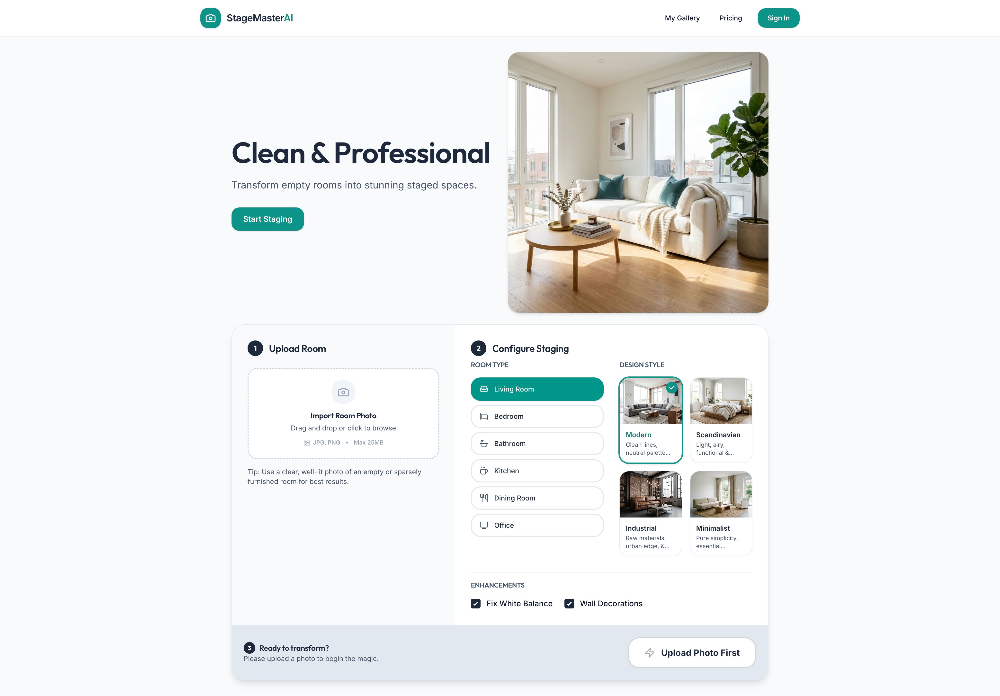

# StageMasterAI

AI-powered virtual staging for real estate agents. Transform empty room photos into stunning staged spaces in minutes.

> [!IMPORTANT]
> This was developed as a vibe-coding test MVP and will likely not be developed further unless someone really nags me about it! Feel free to fork this repository and create your own version of this app!

| Landing Page | Gallery View |
| :---: | :---: |
|  |  |

## Features

- **Clean & Professional UI**: Modern, light-themed interface with a focus on clarity and ease of use.
- **Step-by-Step Workflow**: Intuitive 3-step process: Upload → Configure → Stage.
- **Image Upload**: Drag & drop support for interior photos with real-time preview.
- **Staging Controls**: Select room type (Living Room, Bedroom, Kitchen, etc.) and style presets (Modern, Minimalist, Scandinavian, Industrial).
- **AI Enhancements**: Optional toggles for fixing white balance and adding wall decorations.
- **Async Processing**: Robust job queue using Redis and RQ with real-time status updates.
- **Before/After Comparison**: Interactive slider for viewing staging results side-by-side with the original photo.
- **Compliance**: Automatic virtual staging disclosure labels applied to all generated images.
- **Local-First Architecture**: Entire stack runs locally using Docker, including MinIO for S3-compatible storage.

## Development Plan

This application was developed following the [MVP Design Plan](plans/mvp_design_plan.md), which outlines the core features, architecture, and implementation phases.

## Tech Stack

- **Backend**: FastAPI (Python 3.12), SQLAlchemy, Alembic, Redis, RQ.
- **Frontend**: React 18, Vite, Tailwind CSS, Lucide Icons.
- **Storage**: MinIO (S3-compatible object storage), PostgreSQL.
- **Infrastructure**: Docker & Docker Compose.

## Getting Started

### Prerequisites

- [Docker Desktop](https://www.docker.com/products/docker-desktop/)
- [OpenRouter API Key](https://openrouter.ai/)

### Installation & Setup

1. **Clone the repository**
   ```bash
   git clone <repository-url>
   cd stage-master
   ```

2. **Configure Environment Variables**
   Create a `.env` file in the root directory (or copy from `.env.example`):
   ```bash
   cp .env.example .env
   ```
   Edit `.env` and add your `OPENROUTER_API_KEY`.

3. **Start the Application**
   ```bash
   docker-compose up -d
   ```

4. **Initialize the Database**
   ```bash
   docker-compose exec backend alembic upgrade head
   ```

5. **Access the App**
   - **Frontend**: [http://localhost:5173](http://localhost:5173)
   - **Backend API**: [http://localhost:8000](http://localhost:8000)
   - **API Documentation**: [http://localhost:8000/docs](http://localhost:8000/docs)
   - **MinIO Console**: [http://localhost:9001](http://localhost:9001) (user: `minioadmin`, pass: `minioadmin`)

## Development

### Backend
The backend is a FastAPI application. To run it locally without Docker (for development):
```bash
cd backend
python -m venv venv
source venv/bin/activate
pip install -r requirements.txt
uvicorn app.main:app --reload
```

### Frontend
The frontend is a React application built with Vite. To run it locally:
```bash
cd frontend
npm install
npm run dev
```

## License

This project is licensed under the MIT License - see the [LICENSE](LICENSE) file for details.
