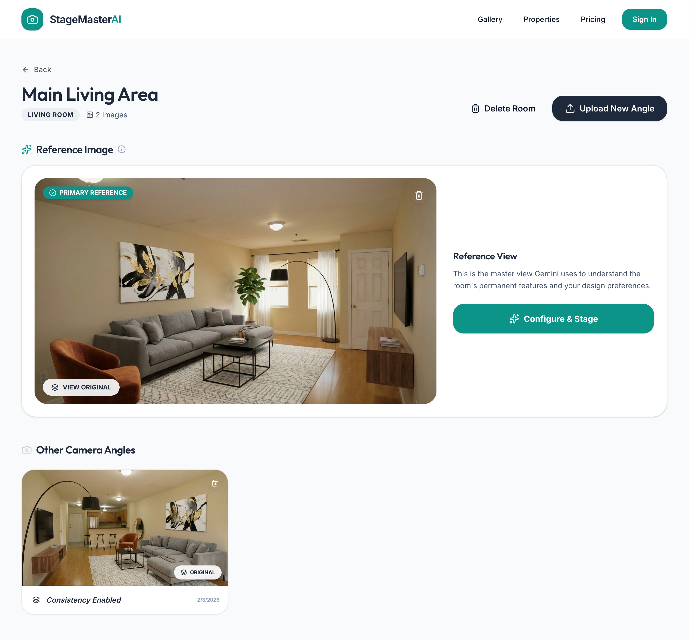
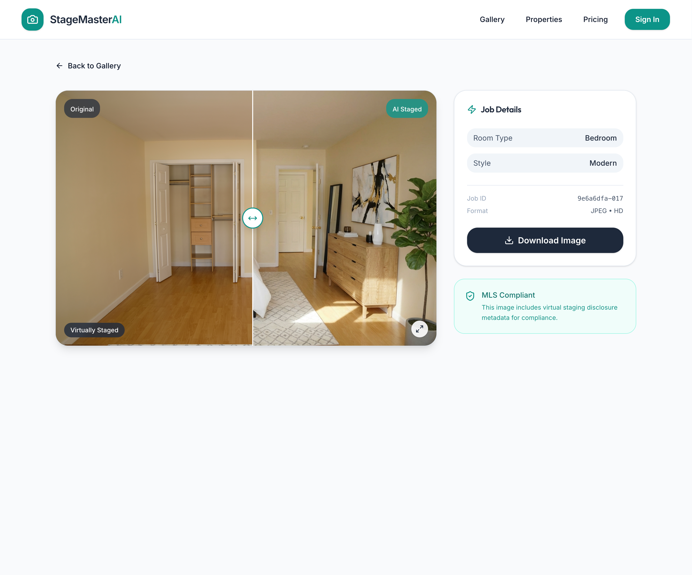
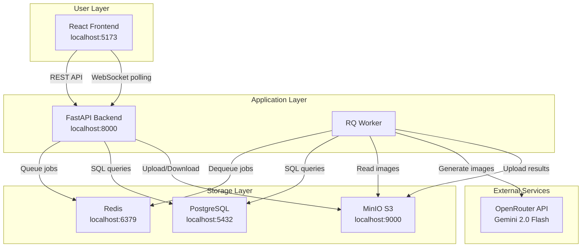
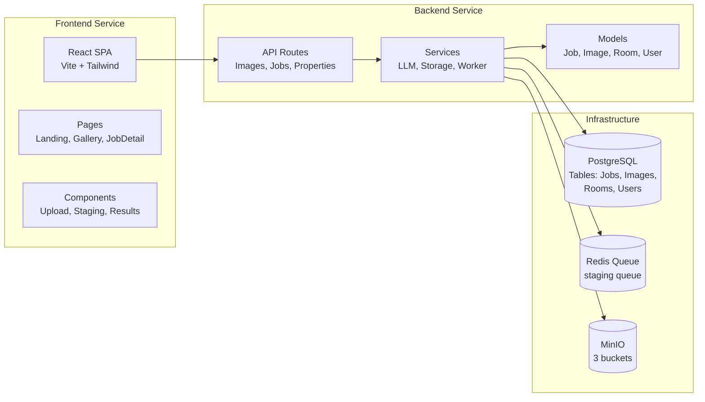
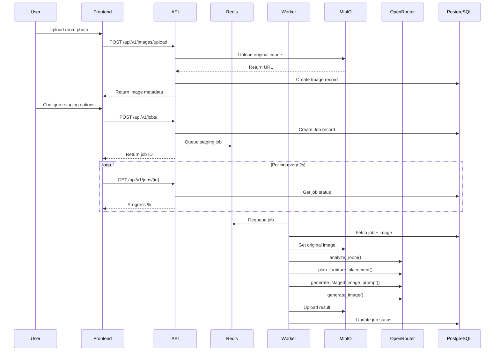

# StageMasterAI

AI-powered virtual staging for real estate agents. Transform empty room photos into stunning staged spaces in minutes using advanced LLM-driven image generation.

> [!IMPORTANT]
> This was developed as a vibe-coding test MVP and will likely not be developed further unless someone really nags me about it! Feel free to fork this repository and create your own version of this app!

| Landing Page | Gallery View |
| :---: | :---: |
|  |  |
| **Room Configuration** | **Staging Progress** |
|  |  |

---

## Table of Contents

- [Overview](#overview)
- [The Staging Process](#the-staging-process)
- [System Architecture](#system-architecture)
- [API Reference](#api-reference)
- [Infrastructure](#infrastructure)
- [Configuration](#configuration)
- [Features](#features)
- [Getting Started](#getting-started)
- [Development](#development)
- [License](#license)

---

## Overview

StageMasterAI is a modern, containerized web application that enables real estate professionals to virtually stage empty rooms using AI. The system leverages large language models (LLMs) via OpenRouter for intelligent room analysis and furniture placement planning, combined with image generation capabilities to produce photorealistic staged images.

### Key Highlights

- **LLM-Powered Intelligence**: Uses Gemini 3.0 Flash via liteLLM/OpenRouter for room analysis, furniture planning, and prompt generation, and Nano Banana Pro for image generation.
- **Multi-Angle Consistency**: Supports staging multiple angles of the same room with consistent furniture placement
- **Async Processing**: Robust job queue using Redis and RQ with real-time progress updates
- **Local-First Storage**: MinIO (S3-compatible) for object storage, running entirely locally via Docker
- **Modern Stack**: FastAPI backend, React frontend with Material Design principles

---

## The Staging Process

The virtual staging pipeline consists of four major stages, orchestrated through an async job queue system.

### Step-by-Step Workflow

```
┌─────────────────────────────────────────────────────────────────────────────┐
│                        STAGING PROCESS WORKFLOW                              │
└─────────────────────────────────────────────────────────────────────────────┘

  ┌──────────┐     ┌──────────┐     ┌──────────┐     ┌──────────┐
  │  UPLOAD  │────▶│  QUEUE   │────▶│ PROCESS  │────▶│  RESULT  │
  │  IMAGE   │     │   JOB    │     │  (4x AI) │     │  READY   │
  └──────────┘     └──────────┘     └──────────┘     └──────────┘
       │                │                │
       │                │                │
       ▼                ▼                ▼
  Upload to       Create Job        Worker picks
  MinIO/S3       in Redis           job from queue
                  Queue

═══════════════════════════════════════════════════════════════════════════════

                     DETAILED STAGING PIPELINE (inside Worker)
                     
  ┌─────────────────────────────────────────────────────────────────────────┐
  │                    _process_staging_job_async()                          │
  └─────────────────────────────────────────────────────────────────────────┘
                                    │
         ┌──────────────────────────┼──────────────────────────┐
         │                          │                          │
         ▼                          ▼                          ▼
  ┌─────────────┐          ┌─────────────────┐          ┌─────────────────┐
  │    STEP 1   │          │     STEP 2      │          │     STEP 3      │
  │  ANALYZE    │────────▶│   PLAN FURNITURE │────────▶│  GENERATE PROMPT│
  │    ROOM     │          │    PLACEMENT    │          │      (LLM)      │
  └─────────────┘          └─────────────────┘          └─────────────────┘
       │                          │                          │
       │ LLM analyzes:            │ LLM plans:               │ LLM creates:
       │ - Surfaces              │ - Furniture items        │ - Detailed prompt
       │ - Windows/doors         │ - Positions              │ - Style keywords
       │ - Fixtures              │ - Decorations            │ - Lighting notes
       │ - Room dimensions       │ - Traffic flow           │ - Camera specs
       │                          │                          │
       ▼                          ▼                          ▼
  ┌─────────────────────────────────────────────────────────────────────────┐
  │                           STEP 4: IMAGE GENERATION                       │
  │  ┌───────────────────────────────────────────────────────────────────┐  │
  │  │                    generate_image()                                │  │
  │  │                                                                   │  │
  │  │  - Sends prompt + original image + reference image to OpenRouter  │  │
  │  │  - Gemini 2.0 Flash generates staged image                        │  │
  │  │  - Returns base64-encoded image                                   │  │
  │  │                                                                   │  │
  │  │  Upload result to MinIO results bucket                            │  │
  │  └───────────────────────────────────────────────────────────────────┘  │
  └─────────────────────────────────────────────────────────────────────────┘
                                    │
                                    ▼
                           ┌─────────────────┐
                           │   JOB STATUS:   │
                           │    COMPLETED    │
                           └─────────────────┘
```

### Processing Stages in Detail

#### Stage 1: Room Analysis (`analyze_room`)

The LLM analyzes the uploaded room photo to identify:

1. **Surfaces & Materials**: Floor type, wall materials, ceiling characteristics
2. **Architectural Features**: Windows, doors, paths of travel, built-in fixtures
3. **Fixed Elements**: Ceiling lights, fans, wall outlets, vents, switches, closet interiors
4. **Room Geometry**: Estimated dimensions, lighting direction
5. **Prominent Wall Space**: Large empty wall surfaces suitable for decorations

#### Stage 2: Furniture Placement Planning (`plan_furniture_placement`)

Based on the analysis, the LLM generates a detailed furniture plan:

1. **Room Type Mapping**: Maps selected room type to appropriate furniture
2. **Style Application**: Applies selected design style (Modern, Minimalist, Scandinavian, etc.)
3. **Furniture Inventory**: Lists specific furniture items with positions
4. **Decorations**: Plans wall art, mirrors, and accessories (if enabled)
5. **Closet Staging**: Organizes closet interiors with clothing and storage items

#### Stage 3: Prompt Generation (`generate_staged_image_prompt`)

Creates a highly detailed prompt for the image generation model:

1. **Style Keywords**: Specific design terminology for the selected preset
2. **Lighting Instructions**: Natural lighting direction preservation
3. **Camera Settings**: Professional photography parameters
4. **Critical Constraints**: "Preserve room geometry", "Do not alter fixtures"

#### Stage 4: Image Generation (`generate_image`)

Final image generation using OpenRouter's multimodal models:

1. **Multi-Image Input**: Sends original image + reference image (if multi-angle)
2. **Prompt Integration**: Provides the generated prompt as instructions
3. **Response Processing**: Extracts base64 image from response
4. **Storage**: Uploads result to MinIO results bucket

---

## System Architecture

### High-Level Architecture



### Component Diagram



### Data Flow Diagram



---

## API Reference

### Base URL

- **Development**: `http://localhost:8000/api/v1`
- **Production**: `https://api.stagemaster.ai/api/v1`

### Endpoints

#### Images

| Method | Endpoint | Description |
|--------|----------|-------------|
| `POST` | `/api/v1/images/upload` | Upload a room photo |
| `GET` | `/api/v1/images/{image_id}` | Get image metadata |
| `DELETE` | `/api/v1/images/{image_id}` | Delete image and associated jobs |

**Upload Image Request:**

```bash
curl -X POST "http://localhost:8000/api/v1/images/upload" \
  -H "Content-Type: multipart/form-data" \
  -F "file=@room.jpg"
```

**Response:**

```json
{
  "id": "uuid-string",
  "user_id": "uuid-string",
  "original_filename": "room.jpg",
  "original_url": "http://localhost:9000/stage-uploads/uuid.jpg",
  "file_size": 1234567,
  "format": "image/jpeg",
  "created_at": "2026-01-11T21:00:00Z"
}
```

#### Jobs

| Method | Endpoint | Description |
|--------|----------|-------------|
| `POST` | `/api/v1/jobs/` | Create a new staging job |
| `GET` | `/api/v1/jobs/` | List all jobs |
| `GET` | `/api/v1/jobs/{job_id}` | Get job status and result |
| `DELETE` | `/api/v1/jobs/{job_id}` | Delete a job |

**Create Job Request:**

```bash
curl -X POST "http://localhost:8000/api/v1/jobs/" \
  -H "Content-Type: application/json" \
  -d '{
    "image_id": "uuid-string",
    "room_type": "living_room",
    "style_preset": "modern",
    "fix_white_balance": false,
    "wall_decorations": true,
    "include_tv": false
  }'
```

**Job Status Response:**

```json
{
  "id": "uuid-string",
  "user_id": "uuid-string",
  "image_id": "uuid-string",
  "room_type": "living_room",
  "style_preset": "modern",
  "status": "completed",
  "progress_percent": 100.0,
  "current_step": "Final rendering complete",
  "result_url": "http://localhost:9000/stage-results/uuid.jpg",
  "original_image_url": "http://localhost:9000/stage-uploads/uuid.jpg",
  "created_at": "2026-01-11T21:00:00Z",
  "completed_at": "2026-01-11T21:02:30Z"
}
```

**Status Values:**

| Status | Description |
|--------|-------------|
| `queued` | Job is waiting in the Redis queue |
| `in_progress` | Worker is processing the job |
| `completed` | Staging finished successfully |
| `error` | An error occurred during processing |

#### Progress Tracking

The `current_step` field provides real-time updates:

| Progress | Step Description |
|----------|------------------|
| 10% | Analyzing room layout... |
| 30% | Detecting surfaces and depth... |
| 60% | Generating furniture placement plan... |
| 80% | Rendering final image... |
| 100% | Final rendering complete |

---

## Infrastructure

### Services Overview

| Service | Container | Port | Purpose |
|---------|-----------|------|---------|
| Frontend | `stage-frontend` | 5173 | React SPA development server |
| Backend | `stage-backend` | 8000 | FastAPI REST + WebSocket server |
| Worker | `stage-worker` | N/A | RQ background job processor |
| Database | `stage-db` | 5432 | PostgreSQL 15 |
| Queue | `stage-redis` | 6379 | Redis 7 (RQ backend) |
| Storage | `stage-minio` | 9000, 9001 | MinIO S3 + Console |

### Storage Buckets

| Bucket | Purpose |
|--------|---------|
| `stage-uploads` | Original uploaded room photos |
| `stage-results` | Generated staged images |
| `stage-thumbnails` | (Reserved) Image thumbnails |

### Environment Variables

| Variable | Default | Description |
|----------|---------|-------------|
| `DATABASE_URL` | `postgresql+asyncpg://postgres:postgres@db:5432/stage_db` | PostgreSQL connection string |
| `REDIS_URL` | `redis://redis:6379/0` | Redis connection string |
| `STORAGE_ENDPOINT` | `minio:9000` | MinIO internal endpoint |
| `STORAGE_PUBLIC_ENDPOINT` | `localhost:9000` | MinIO public endpoint |
| `STORAGE_ACCESS_KEY` | `minioadmin` | MinIO root user |
| `STORAGE_SECRET_KEY` | `minioadmin` | MinIO root password |
| `OPENROUTER_API_KEY` | (required) | OpenRouter API key |
| `LITELLM_ANALYSIS_MODEL` | `openrouter/google/gemini-2.0-flash-exp:free` | LLM for analysis & planning |
| `LITELLM_GENERATION_MODEL` | `openrouter/google/gemini-2.0-flash-exp:free` | LLM for image generation |

---

## Configuration

### Style Presets

| Preset | Description |
|--------|-------------|
| `modern` | Clean lines, neutral colors, minimalist furniture |
| `minimalist` | Ultra-simple, lots of negative space, functional |
| `scandinavian` | Light woods, cozy textiles, functional design |
| `industrial` | Exposed elements, metal accents, raw materials |
| `coastal` | Light blues, natural textures, beach-inspired |
| `farmhouse` | Rustic, vintage elements, warm neutrals |
| `bohemian` | Eclectic patterns, global influences, plants |
| `luxury` | Elegant, rich materials, sophisticated |
| `midcentury` | Retro 1950s-60s, organic shapes |

### Room Types

- `living_room`
- `bedroom`
- `kitchen`
- `dining_room`
- `office`
- `other`

### Image Processing

The system automatically:
- Resizes images exceeding 2160px (longest dimension)
- Converts images to base64 for LLM processing
- Preserves aspect ratio during processing
- Applies virtual staging disclosure labels to results

---

## Features

### Core Features

- **Clean & Professional UI**: Modern, light-themed interface with Material Design principles
- **Step-by-Step Workflow**: Intuitive 3-step process: Upload → Configure → Stage
- **Image Upload**: Drag & drop support with real-time preview
- **Room Type Selection**: Living Room, Bedroom, Kitchen, Dining Room, Office, Other
- **Style Presets**: 9 design styles (Modern, Minimalist, Scandinavian, Industrial, Coastal, Farmhouse, Bohemian, Luxury, Mid-Century)
- **AI Enhancements**: Optional white balance correction and wall decorations
- **Multi-Angle Staging**: Stage multiple angles of the same room with consistent furniture

### Technical Features

- **Async Processing**: Redis Queue (RQ) for reliable job processing
- **Real-time Updates**: Progress polling with detailed step descriptions
- **Before/After Comparison**: Interactive slider for viewing results
- **Compliance**: Automatic virtual staging disclosure labels
- **Multi-Container Docker**: Separate containers for frontend, backend, worker
- **Local Storage**: MinIO for S3-compatible object storage

---

## Getting Started

### Prerequisites

- [Docker Desktop](https://www.docker.com/products/docker-desktop/)
- [OpenRouter API Key](https://openrouter.ai/)

### Installation & Setup

1. **Clone the repository**

```bash
git clone <repository-url>
cd stagemaster-ai
```

2. **Configure Environment Variables**

Create a `.env` file in the root directory:

```bash
cp .env.example .env
```

Edit `.env` and add your OpenRouter API key:

```env
OPENROUTER_API_KEY=sk-xxxxx-your-openrouter-key
```

3. **Start the Application**

```bash
docker-compose up -d
```

4. **Initialize the Database**

```bash
docker-compose exec backend alembic upgrade head
```

5. **Access the Application**

| Service | URL |
|---------|-----|
| Frontend | http://localhost:5173 |
| Backend API | http://localhost:8000 |
| API Documentation | http://localhost:8000/docs |
| MinIO Console | http://localhost:9001 (user: `minioadmin`, pass: `minioadmin`) |

---

## Development

### Backend Development

Run the backend locally without Docker:

```bash
cd backend
python -m venv venv
source venv/bin/activate
pip install -r requirements.txt
uvicorn app.main:app --reload
```

### Frontend Development

Run the frontend locally:

```bash
cd frontend
npm install
npm run dev
```

### Database Migrations

Create a new migration:

```bash
docker-compose exec backend alembic revision -m "description"
```

Apply migrations:

```bash
docker-compose exec backend alembic upgrade head
```

### View Logs

```bash
# Backend logs
docker-compose logs backend

# Worker logs
docker-compose logs worker

# All services
docker-compose logs -f
```

---

## Development Plan

This application was developed following the [MVP Design Plan](plans/mvp_design_plan.md), which outlines the core features, architecture, and implementation phases.

---

## Tech Stack

| Layer | Technology |
|-------|------------|
| Backend | FastAPI (Python 3.12), SQLAlchemy, Alembic, Redis, RQ |
| Frontend | React 18, Vite, Tailwind CSS, Lucide Icons |
| Storage | MinIO (S3-compatible), PostgreSQL 15 |
| AI/ML | liteLLM, OpenRouter, Gemini 2.0 Flash |
| Infrastructure | Docker, Docker Compose |

---

## License

This project is licensed under the MIT License - see the [LICENSE](LICENSE) file for details.
